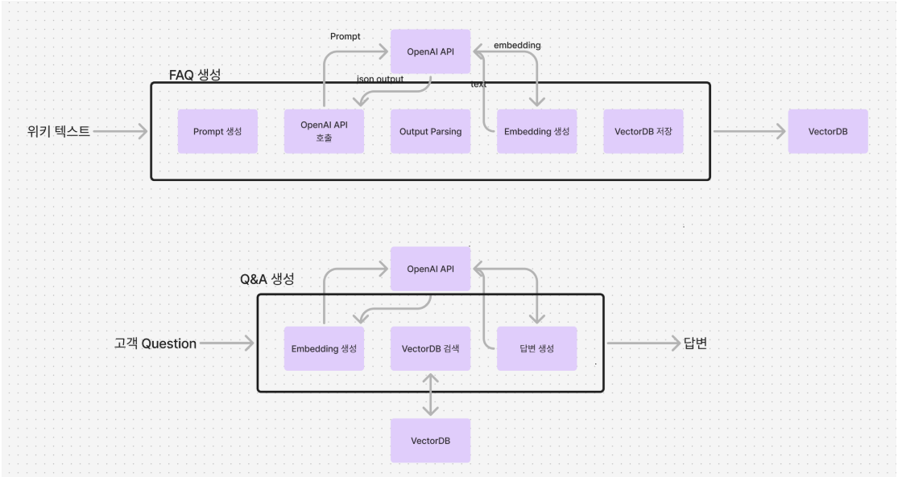
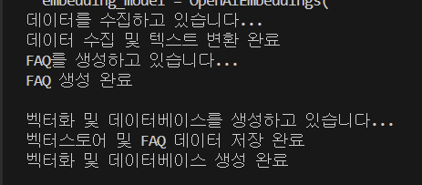
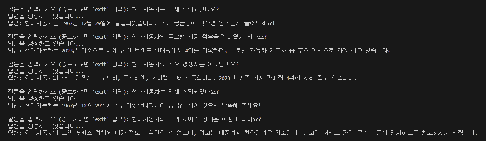

# 현대자동차 FAQ 챗봇 프로젝트

## 📖 소개   
현대자동차 FAQ 챗봇 프로젝트는 웹에서 현대자동차에 대한 정보를 수집하고   
이를 기반으로 FAQ를 생성하여 사용자 질문에 대한 답변을 제공하는 챗봇입니다.    
OpenAI의 GPT-4o-mini 모델과 LangChain 라이브러리를 활용하여 자연어 이해와 생성 기능을 구현하였습니다.

## 📄 프로젝트 아키텍처   
   

## 🚀 주요 기능      
### 데이터 수집:     
지정된 웹 페이지(URL)에서 현대자동차에 대한 정보를 자동화된 크롤링 기법을 통해 수집하고, 자연어 처리에 적합한 텍스트 데이터를 파싱하여 추출합니다.      
### FAQ 생성:    
수집된 텍스트 데이터를 OpenAI의 GPT 모델을 사용하여 요약 및 의미 분석을 수행하고, 자주 묻는 질문(FAQ)과 그에 대한 답변을 자동으로 생성합니다.     
### 벡터화 및 검색:    
생성된 FAQ의 질문을 고차원 임베딩 벡터로 변환하고, FAISS를 활용하여 벡터 인덱스를 구축하여 대용량 데이터에서의 효율적인 유사도 검색을 지원합니다.      
### 질문 응답     
사용자의 입력 질문을 임베딩하여 벡터스토어에서 가장 유사한 질문을 실시간으로 검색하고, 해당 FAQ의 답변과 GPT 모델을 조합하여 자연스럽고 정확한 응답을 생성합니다.   

## 📝 주요 파일 설명   
### main.py   
전체 프로그램의 흐름을 관리하며, 각 모듈을 호출하여 작업을 수행합니다.   
OpenAI API 키 설정 및 임베딩 모델 초기화를 포함합니다.   

### data_collection.py   
load_and_transform(url) 함수는 지정된 URL에서 텍스트 데이터를 추출합니다.   
웹 크롤링을 통해 현대자동차에 대한 정보를 수집합니다.   

### faq_generation.py
generate_faq(text, num_faqs=10) 함수는 추출된 텍스트를 기반으로 FAQ를 생성합니다.   
OpenAI의 GPT 모델을 사용하여 자연스러운 질문과 답변 쌍을 만듭니다.   

### vectorization.py   
vectorize_faq(faq_items, embedding_model) 함수는 FAQ의 질문을 임베딩하고, 벡터스토어를 구축합니다.   
FAISS 라이브러리를 사용하여 고속 유사도 검색을 지원합니다.   

### question_answering.py
generate_answer(user_question, embedding_model) 함수는 사용자 질문에 대해 가장 유사한 FAQ를 찾아 답변을 생성합니다.   
GPT 모델을 사용하여 자연스럽고 정확한 응답을 제공합니다.   

## 🔨 실행 예시    
1. python main.py 명령어 입력   
2. 로딩...   
   
3. 질문 시작    
   
4. exit으로 질문 종료    